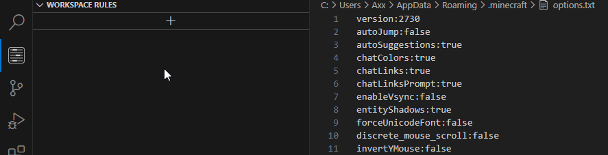
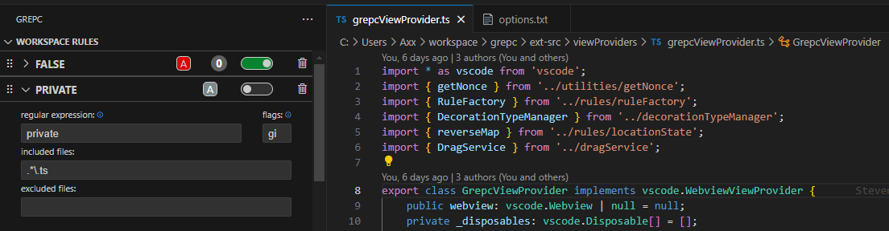
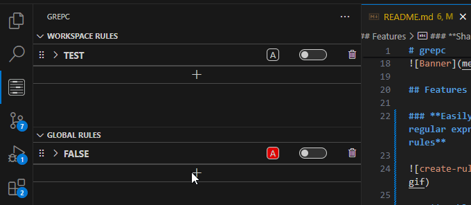
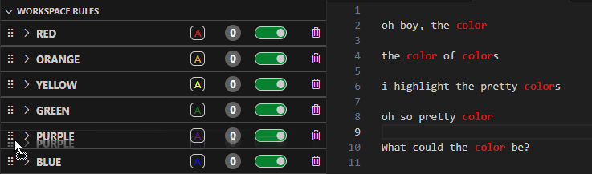
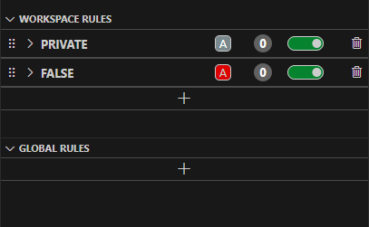
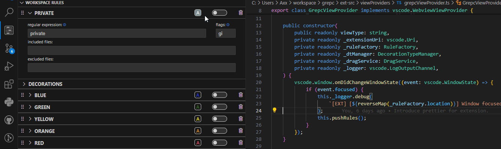
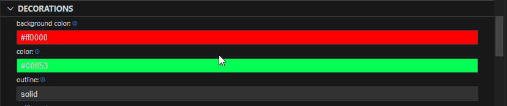
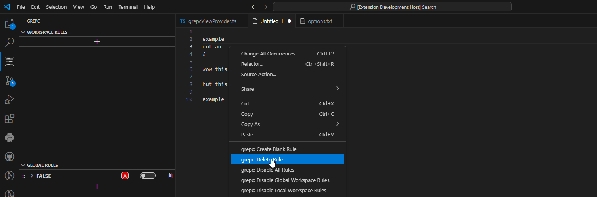

# grepc

> **grep + color**

    

Grepc is an approachable regular expression highlighter with advanced customization for VS Code.

## Features

### **Easily decorate text with any regular expression and save them as rules**

### **Enable and disable decoration rules across all files or per file type**

### **Share rules across multiple workspaces or keep them workspace specific**

### **Have overlapping rules? Drag & drop to change execution priority**

### **Drag & drop to transfer between workspace rules and global rules**

### **See all matches of the current rule in an readable and approachable interface**

### **Adjust font style, color, background color, border, outline, and more as needed.**

### **Easy commands for creating, enabling, disabling, and removing rules for decoration.**

## Usage

-   Simply open the tree view in the left hand bar.
-   Optionally, use one of the following by right-clicking in the editor:

| Command                    | Title                                   | Description                                                                           |
| -------------------------- | --------------------------------------- | ------------------------------------------------------------------------------------- |
| `grepc.addRule`            | `grepc: Create Blank Rule`              | Add a rule to local or global rule managers through a series of menus.                |
| `grepc.addTextRule`        | `grepc: Create Rule From Selection`     | Add a rule by selecting text to be the regex and then following the quick pick menus. |
| `grepc.deleteRule`         | `grepc: Delete Rule`                    | Delete a rule from the workspace or global managers.                                  |
| `grepc.enableAllRules`     | `grepc: Enable All Rules`               | Enable all rules in the workspace and global.                                         |
| `grepc.enableLocalRules`   | `grepc: Enable Local Workspace Rules`   | Enable all local rules.                                                               |
| `grepc.enableGlobalRules`  | `grepc: Enable Global Workspace Rules`  | Enable all global rules.                                                              |
| `grepc.disableAllRules`    | `grepc: Disable All Rules`              | Disable all rules.                                                                    |
| `grepc.disableLocalRules`  | `grepc: Disable Local Workspace Rules`  | Disable local rules.                                                                  |
| `grepc.disableGlobalRules` | `grepc: Disable Global Workspace Rules` | Disable global rules.                                                                 |
| `grepc.showWhatsNew`       | `grepc: Show What's New`                | Show what's new page that displays for each major and minor update.                   |

## Installation

The easiest way to install is through the VS Code Marketplace.

Alternatively, you can install any version of grepc by going to the [releases](https://github.com/stneveadomi/grepc/releases) and downloading the specific .vsix file. From there, you can follow the instructions [here](https://code.visualstudio.com/docs/editor/extension-marketplace#_install-from-a-vsix).

## Release Notes

See [releases](https://github.com/stneveadomi/grepc/releases)

## Contributing

Find an issue or a potential new feature? Create an issue on the GitHub page.

Feel free to review the current issues if interested in contributing.

If interested in more information, reach out to @stneveadomi on GitHub.

## Credits

Created by Steven Neveadomi.

Shout out to the following beta testers: Chelsey Jurado, Dominic Nappi

Shout out to Brooke Thomson for designing the logos.
You can see more of her work [here](https://brookehthomson.wixsite.com/portfolio)

## License

MIT @ Steven Neveadomi
