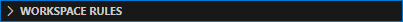

# Open local rules

1. Click on grepc icon in the activity bar on the left-hand side of the editor.  
  
  
  
2. Select the local rules drop down bar.

    

3. Congratulations! You can now see where the local rules are. Click on the + icon to create a new rule.